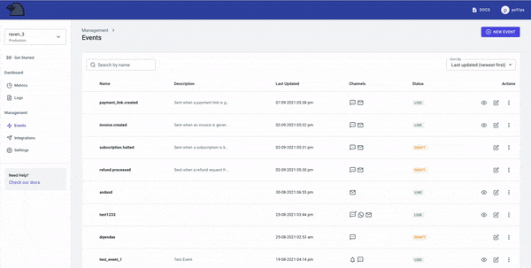

# Sending SMS

## 💬 Steps to start sending SMS

### Step 1. Raven Account Setup

If you have not signed up on Raven yet, please [sign up for free](https://console.ravenapp.dev/register).&#x20;

You can either use the default App (\<your-account-name\_test>) created on sign up or create a new one by going to the [Settings tab](https://console.ravenapp.dev/app/management/settings) in the dashboard. To know more please check our [platform doc on Apps](../../platform/apps/). Collect your [credentials](../../#credentials) (API Key and App ID) as you will need them in the API to trigger notifications.


📘 **Note:** \
If you are sending SMSs in India, TRAI has mandated to register your business, headers (sender IDs), and templates on any of the DLT platforms. If you have not done this already, you should check the [guide](https://www.textlocal.in/tcccpr-trai-dlt-registration/) on getting the DLT setup done.



### Step 2. Add an SMS Integration&#x20;

An Integration is nothing but a provider like Twilio, MessageBird etc. You can add/remove any provider without having to manage their APIs. Head over to [Integrations tab](https://console.ravenapp.dev/app/management/integrations) in the dashboard and select SMS. You will see a list of available SMS integrations as shown here:


At this point, you either would be using your own SMS providers or would be looking to add a new one.



*   When you are adding a new provider integration, you need to first select one and create an account with them. As a prerequisite, you will also have to purchase a phone number or a sender id with the provider.


* On the dashboard, click on your Integration from the list and add the keys. Please check our SMS Integrations doc, to know how to get the setup done and add the keys in Raven.


[integrations](../integrations/)



💡**Tip:** \
In the default app (**`<your-account-name_test>`**) __ created on sign up, we have already added a Raven SMS integration. The sender id/phone number is purchased by Raven and therefore should only be used for testing purposes. You can view this integration in the Live tab.




* In this case you would already have a phone number/sender id purchased with the provider to send SMS.\

* Now, on the dashboard you can select your Integration and add the keys. Please check our SMS Integrations doc to help you add your Integration.


[integrations](../integrations/)


*   If you are adding multiple SMS integrations, you may want to&#x20;

    1. spilt traffic amongst them  or
    2. use one as fallback or&#x20;
    3. have conditions like use Twilio for US and MessageBird for Europe.&#x20;

    You can check our platform doc on [Integration Rules](../../platform/integrations/integration-rules.md) for this.



Once you have added your Integration, you will be able to view it in the Live tab on the dashboard. You can always add/remove/update any integration without having to manage any code. \
If you do not see the Integration you are looking for, please email us on support@ravenapp.dev, and we will add it to the list.


### Step 3. Create an Event

Events define - which notifications to send, what should the content be and how to send them. You can manage all this directly from the dashboard without having to write a single line of code. Check our platform doc on [Events](../../platform/events/) for more details.



To send an SMS, we need to first create an event with SMS enabled. In this event, we will add the message content and select the integration to send this SMS with (the integration we added in the previous step). Head over to [Events tab](https://console.ravenapp.dev/app/management/events) in the dashboard and click on the Create Event button.&#x20;

1. Give a unique name to this event. This name will be used to trigger the event in the Send Event API.
2. Select SMS as a channel to send notifications. Also, select the Integration that you added earlier in Step 2. \
   If you are using multiple SMS Integrations, you can add one as a fallback. Select the "More Options" switch to add fallbacks.
3.  Create the SMS template. You can add dynamic text to the template like user name, invoice number, order id etc., with the handlebar notation, like this `{{user_name}}`

    For more details on SMS templates, encoding, languages etc, please check our SMS Template doc.


[template.md](../template.md)


Your event is created! You will be able to see it in the Events list now.


### Step 3. Trigger the Event

Now we just need to test if our setup works. Trigger the event that you created above. You can either do this from the dashboard itself (Go to Events tab > Click on View Event Button (Eye) > Dialog opens > Click on Test Event). The other way is to hit the API directly with cURL or Postman. Below is how the API will look like -&#x20;

```http
curl --location \
--request POST 'https://api.ravenapp.dev/v1/apps/<YOUR_APP_ID>/events/send' \
--header 'Authorization: AuthKey <YOUR_API_KEY>' \
--header 'Content-Type: application/json' \
--data-raw '{
    "event": <YOUR_EVENT_NAME>,
    "user": {
        "mobile": <YOUR_MOBILE_NUMBER>
    },
    "data": {
        "user_name": "John Doe"
    }
}'
```

|                             |                                                                                                                        |
| --------------------------- | ---------------------------------------------------------------------------------------------------------------------- |
| **YOUR\_APP**_**\_**_**ID** | App ID of the currently selected App. Go to `Settings > App` in the dashboard to view.                                 |
| **YOUR\_API\_KEY**          | The Account API Key. Go to `Settings > Account` in the dashboard to view.                                              |
| **YOUR\_EVENT\_NAME**       | Name of the Event we created above in Step 2.                                                                          |
| **YOUR\_MOBILE\_NUMBER**    | Mobile number to which the SMS should be sent to.                                                                      |
| `data`                      | The `data`  object contains `"key": "value"`  pairs of any dynamic text that you would have added in the SMS template. |

Copy the cURL request and simply hit enter in your terminal.


Great! You’ve successfully sent an SMS with Raven. [👍](https://emojipedia.org/thumbs-up/)



### Step 4. Verify in Logs

As a final step, we can verify if everything went well and the notification was sent. Raven provides a single view of all logs across all channels. You can view the request payload, the response and the status of the notification sent. You can check our platform doc on [Logs & Metrics](../../platform/logs-and-metrics.md) for more details.\
\
Head over to [Logs tab](https://console.ravenapp.dev/app/management/events) in the dashboard and click on View icon of the first log entry. You will be able to see the details of the payload and the status of the notification that you sent.

.png>)


If you were able to successfully receive the SMS, you are all set! 👍\
If you are facing any issues, please email us on **support@ravenapp.dev**


## 🛎️ Important Links

### SMS Integrations


[integrations](../integrations/)


### SMS Template


[template.md](../template.md)


### API for sending SMS


[send-event.md](../../api-reference/send-event.md)



